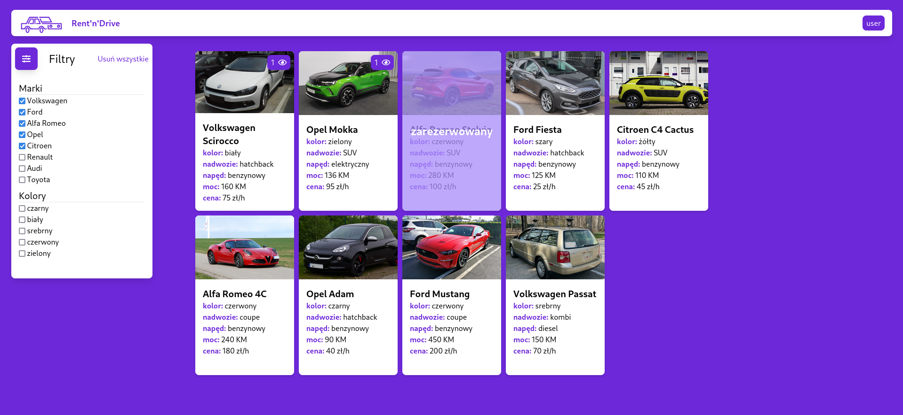
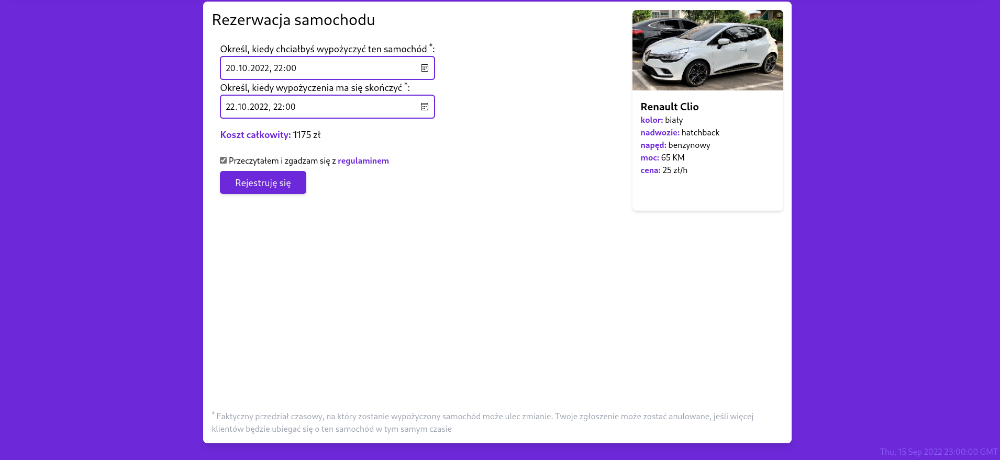
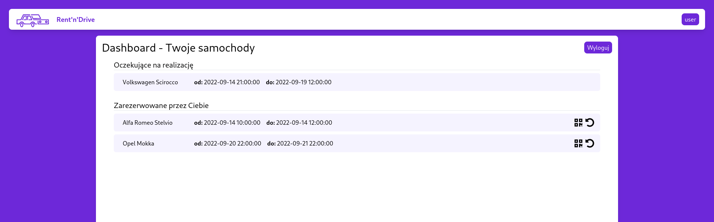
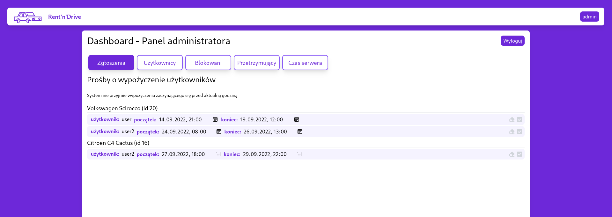

# Projekt wypożyczalni samochodów

**Rent'n'drive** to prosty serwis, na którym można wypożyczyć samochody na ustalony czas i dostać wycenę, ile takie wypożyczenie może kosztować. Aby dokonać rezerwacji samochodu należy się zarejestrować a następnie zalogować.

Ostateczny termin rezerwacji może zostać zmieniony przez administratora serwisu; użytkownik może zobaczyć kiedy jego samochód będzie dla niego dostępny.

Obowiązkiem użytkownika jest zwrócenie samochodu zanim upłynie czas rezerwacji - jeśli tego nie zrobi, samochód zostanie odebrany mu przez administratora, a użytkownik może zostać za karę zablokowany.

Wszystkie te operacje są symboliczne - sprowadzają się do kliknięcia odpowiedniego przycisku.

## Wykorzystane technologie

Front-end został przygotowany z wykorzystaniem frameworku `Svelte`. Po stronie serwerowej pracuje `Apache`; język backendowy to `PHP`. Współpracuje z `bazą danych SQL mariadb`. Całość można uruchomić lokalnie za pomocą `dockera` i skryptu `basha`, który buduje i uruchamia potrzebne kontenery.

Całość została sprawdzona na nowej przeglądarce Edge, a co za tym idzie, aplikacja powinna działać na przeglądarkach opartych na Chromium.

## Uwagi

1. Dla umożliwienia bezproblemowego uruchomienia projektu przygotowałem skrypt, który znajduje się w repozytorium pod nazwą `localrun.sh`.

1. **Projekt należy uruchamiać na przeglądarkach opartych na Chromium.** Pole combo do wprowadzania daty i godziny na Firefox działa inaczej i nie współpracuje odpowiednio z kodem front-endowym, przez co rezerwacja samochodu jest problematyczna.

1. **Czas serwera jest symulowany** - 1 godzina trwa 1 minutę. Administrator może zarządzać czasem serwera w panelu administracyjnym.

1. Niezależnie od terminu rezerwacji, **serwis potrafi przyjąć jedynie jedną rezerwację dla samochodu.** Kiedy administrator wybierze osobę której przydzieli samochód, wszystkie inne rezerwacje są anulowane.

1. Przy starcie aplikacji tworzone są dwa konta testowe z hasłem `zaq1@WSX`:
   - admin
   - user

## Opis funkcjonalności

### Strona startowa

Wyświetlana jest lista samochodów w wypożyczalni. Użytkownik może zastosować filtry by zawęzić listę. Widać, które auto jest zarezerwowane, a którym interesują się użytkownicy.

 

### Strona rezerwacji

Aplikacja pilnuje, żeby użytkownik nie wybrał terminu przeszłego. Należy zwracać uwagę na czas serwera w prawym dolnym rogu, nie czas rzeczywisty.

### Panel użytkownika

Z tej strony można się wylogować. Użytkownik może zobaczyć swoje rezerwacje i wypożyczone samochody. Samochód może oddać, klikając strzałkę obok wybranego samochodu.

### Panel administratora

Adminstrator ma dostęp do różnych funkcji zarządzania rezerwacjami i użytkownikami.

- W Zgłoszeniach może wybrać zgłoszenie do przyjęcia i ewentualnie edytować ich termin (edycję można wyczyścić, klikając symbol gumki).
- W zakładce użytkownicy może promować wybranego użytkownika do roli administratora.
- W zakładce Blokowani może zobaczyć blokowanych użytkowników i ich odblokować.
- Przetrzymujący to zakładka, gdzie pojawiają się osoby, które nie oddały przed upływem terminu samochodu. Tam można zabrać im samochód lub zablokować użytkownika - wtedy automatycznie traci wszystkie wypożyczenia.
- Czas serwera to zakładka, gdzie można zmienić dzień i godzinę i włączyć lub wyłączyć automatyczny upływ czasu.
